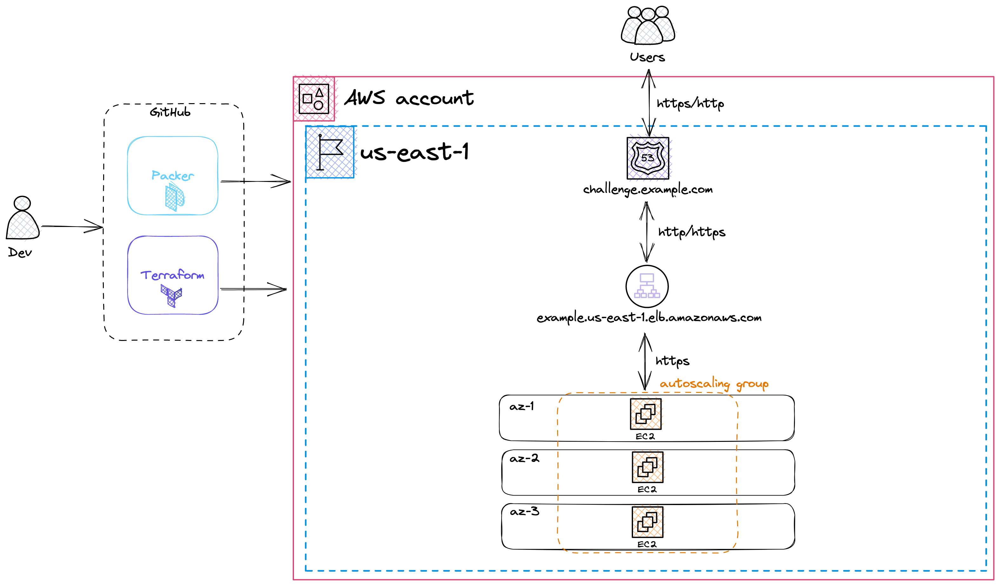

## Deploy a highly-available webserver

#### Table of Contents
[Overview](#overview)  
[Directory layout](#directory-layout)  
[How to use](#how-to-use)  
[Architecture](#architecture)  

### Overview

This project uses Packer and Terraform to create and configure a highly-available website. 

### Directory layout  
  - [.github/workflows](.github/workflows): hosts all the files relating to GitHub Actions.
    - [deployment.yaml](.github/workflows/deployment.yaml): contains the code for the job that deploys Terraform.
    - [docs.yaml](.github/workflows/docs.yaml): contains the code for the job that builds the Terraform docs.
    - [image.yaml](.github/workflows/image.yaml): contains the job code that runs Packer.
  - [packer](packer): hosts all the files related to Packer and the image that it builds.
    - [index.html](packer/index.html): index page for the webserver.
    - [website](packer/website): NGINX server configuration.
    - [webserver.pkr.hcl](packer/webserver.pkr.hcl): Packer configuration to build the AMI.
  - [terraform](terraform): contains all of the Terraform IAC.
    - [README.md](terraform/README.md): README generated by Terraform docs job in pipeline.
    - [main.tf](terraform/main.tf): main Terraform file.
    - [dns.tf](terraform/dns.tf): contains code related to DNS, certificates, and CNAME associtation.
    - [loadbalancer.tf](terraform/loadbalancer.tf): contains code relating to the load balancer.
    - [variables.tf](terraform/variables.tf): variables files.
    - [webserver.tf](terraform/webserver.tf): contains code that deploys server, autoscaling group, and launch config
    - [outputs.tf](terraform/outputs.tf): outputs from Terraform deployment.
    
### How to use

### Architecture

